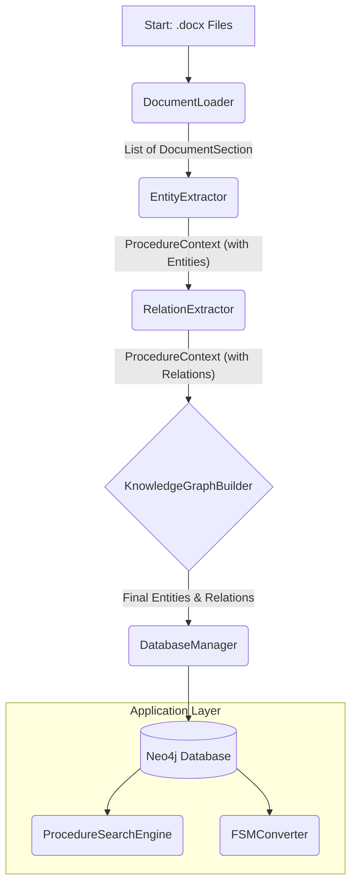

# Codebase Architecture Documentation

This document provides a technical overview of the Python modules within the `codebase` directory. It details the primary classes, key methods, and data structures that form the 3GPP Knowledge Graph construction pipeline.

## 1. High-Level Overview

The primary goal of this project is to parse 3GPP technical specification documents (`.docx`), extract key telecommunications entities (e.g., Network Functions, Procedures, Messages) and their relationships, and build a comprehensive, queryable knowledge graph in a Neo4j database. This graph then serves as the foundation for a semantic search engine and the automatic generation of Finite State Machines (FSMs) for use in conformance testing.

## 2. Architectural Flow

The process is orchestrated by `main.py` and driven by the `KnowledgeGraphBuilder` class, which utilizes the other modules in a sequential pipeline.

### Data Flow Diagram

The following diagram illustrates how data flows between the core components:

### Component Sequence

The pipeline operates in two main phases: an incremental build phase and a finalization phase.

**Build Phase (per-document loop):**
1.  **`DocumentLoader`**: Reads and parses all `.docx` files into structured text sections.
2.  **`KnowledgeGraphBuilder`**: Iterates through each document.
3.  **`EntityExtractor`**: For the current document, processes its text to identify and extract entities, generating rich descriptions for them using an LLM.
4.  **`RelationExtractor`**: Establishes relationships between the entities extracted from the current document.
5.  **`DatabaseManager`**: Writes the entities and relationships for the current document as nodes and edges into the Neo4j database. This step is repeated for every document, keeping memory usage low.

**Finalization Phase:**
6.  **`DatabaseManager`**: After all documents are processed, new methods (`get_all_entities`, `get_all_relationships`) are called to fetch the entire, complete graph from the database.
7.  **`ProcedureSearchEngine`**: Consumes the complete entity list fetched from the database to build a globally-aware TF-IDF search index.
8.  **`FSMConverter`**: Uses the graph data fetched from the database to model procedures as state machines.

---

## 3. Core Data Structures (`data_structures.py`)

This module contains no executable code but is critical as it defines the core data classes that are passed between all other modules.

*   **`DocumentSection`**: Represents a clause or sub-clause parsed from a source `.docx` document.
    *   **Attributes**: `title: str`, `text: str`, `clause: str`, `document: str`, `has_figure: bool`, `is_procedure: bool`.

*   **`Entity`**: The primary representation of a node in the knowledge graph.
    *   **Attributes**: `name: str`, `entity_type: str`, `properties: Dict`, `description: Optional[str]`, `parent_title: Optional[str]`, `search_keywords: List[str]`, `embedding: Optional[List[float]]`, `title_embedding: Optional[List[float]]`, `parent_title_embedding: Optional[List[float]]`.

*   **`Relationship`**: The primary representation of an edge (relationship) in the knowledge graph.
    *   **Attributes**: `source_name: str`, `target_name: str`, `rel_type: str`, `properties: Dict`, `is_transition: bool`.

*   **`ProcedureContext`**: A temporary data container that holds all extracted information for a single procedure while it is being processed by the pipeline. It is passed from the entity extractor to the relation extractor.
    *   **Attributes**: `procedure_name: str`, `section: DocumentSection`, `network_functions: List[str]`, `messages: List[str]`, `parameters: List[str]`, `keys: List[str]`, `steps: List[str]`, `step_descriptions: Dict[str, str]`.

*   **`ExtractionResult`**: A wrapper object returned by the `EntityExtractor` to hold the results of its extraction process.
    *   **Attributes**: `entities: Dict[str, List[str]]`, `relationships: List[Relationship]`, `success: bool`.

*   **`SearchQuery`**: An object that encapsulates all the parameters for a search operation.
    *   **Attributes**: `query_text: str`, `entity_types: Optional[List[str]]`, `max_results: int`.

*   **`SearchResult`**: A wrapper for a single item returned from a search, combining the entity with its search score.
    *   **Attributes**: `entity: Entity`, `similarity_score: float`, `match_type: str`.

*   **`FSMState`**: Represents a single state within a `FiniteStateMachine`, corresponding to a `Step` entity.
    *   **Attributes**: `name: str`, `step_entity: Entity`, `is_initial: bool`, `is_final: bool`.

*   **`FSMTransition`**: Represents a transition between two `FSMState` objects.
    *   **Attributes**: `source_state: str`, `target_state: str`, `trigger: str`, `message: Optional[str]`.

*   **`FiniteStateMachine`**: The complete FSM representation of a procedure, containing all its states and transitions.
    *   **Attributes**: `procedure_name: str`, `states: List[FSMState]`, `transitions: List[FSMTransition]`, `initial_state: Optional[str]`, `final_states: List[str]`.

---

## 4. Detailed Module Descriptions

### `main.py`

*   **Purpose**: The main entry point for the application. It initializes and runs the full knowledge graph construction pipeline and then demonstrates the search and FSM conversion functionalities.
*   **Method Reference**:
    *   `main()`
        *   **Description**: Initializes the `KnowledgeGraphBuilder` and starts the `build_knowledge_graph` process. After completion, it calls `demo_search_and_fsm`.
        *   **Parameters**: None.
        *   **Returns**: `None`.
    *   `demo_search_and_fsm(builder)`
        *   **Description**: Takes the completed `builder` instance to initialize and demonstrate the `ProcedureSearchEngine` and `FSMConverter`.
        *   **Parameters**:
            *   `builder` (`KnowledgeGraphBuilder`): The instance of the graph builder containing the collected entities and relationships.
        *   **Returns**: `None`.

### `config.py`

*   **Purpose**: A non-executable module that provides centralized configuration for the entire application. It contains no classes or methods.
*   **Key Sections**:
    *   **Database Configuration**: `NEO4J_URI`, `NEO4J_USER`, `NEO4J_PASSWORD`.
    *   **Model Options**: `LLM_MODEL_OPTIONS`, `EMBEDDING_MODEL_OPTIONS` for model selection.
    *   **3GPP Entity Whitelists**: `KNOWN_NETWORK_FUNCTIONS`, `KNOWN_PARAMETERS`, `KNOWN_KEYS`, `KNOWN_MESSAGES` for validation.
    *   **Search & Output**: `SEARCH_CONFIG`, `SEARCH_WEIGHTS` (for the hybrid model: `W_TITLE`, `W_PARENT`, `W_SEMANTIC`), `MAX_DESC_LENGTH`, `OUTPUT_CONFIG` for controlling search behavior and file paths.

### `document_loader.py`

*   **Purpose**: Handles the initial loading and parsing of raw `.docx` files and identifies which text sections describe procedures.
*   **Main Class**: `DocumentLoader`
*   **Method Reference**:
    *   `__init__(self, llm_pipeline)`
        *   **Description**: Initializes the loader with a reference to the text generation pipeline for procedure identification.
        *   **Parameters**:
            *   `llm_pipeline`: A `transformers` pipeline object.
        *   **Returns**: `None`.
    *   `_extract_sections_with_figures(self, file_paths)`
        *   **Description**: The main parsing method. It iterates through a document's paragraphs, reconstructing section text while preserving newlines between paragraphs. It extracts embedded images, accurately associates them with figure captions, and stores detailed `FigureMetadata` including `r_id` and `target_ref` for debugging and later processing. It classifies diagrams as sequence diagrams using text-based heuristics.
        *   **Parameters**: `file_path` (`Path`): A `pathlib.Path` object pointing to a single document.
        *   **Returns**: (`List[DocumentSection]`): A list of `DocumentSection` objects from the parsed document.
    *   `_is_figure_caption_for_section(self, text, section_clause)`
        *   **Description**: A critical validation method that checks if a line of text is a figure caption and, most importantly, if the figure number in the caption (e.g., "Figure 4.2-1") corresponds to the section number it is in. This prevents cross-references from being misidentified as figures.
        *   **Parameters**: `text` (`str`), `section_clause` (`str`).
        *   **Returns**: (`bool`): `True` if the text is a valid, section-specific figure caption.
    *   `_is_section_header(self, para, text: str) -> bool`
        *   **Description**: Determines if a paragraph is a section header, now including a regex check for `H<digit>` style names to improve header recognition.

### `entity_extractor.py`

*   **Purpose**: Extracts structured entities from the raw text of a procedure, using a hybrid of LLM prompts and pattern-matching, with enhanced step parsing capabilities.
*   **Main Class**: `EntityExtractor`
*   **Method Reference**:
    *   `__init__(self)`
        *   **Description**: Initializes the extractor, sets up the compute device, and loads NLP models.
        *   **Parameters**: None.
        *   **Returns**: `None`.
    *   `extract_entities_for_procedure(self, context)`
        *   **Description**: The primary public method. It orchestrates the entire entity extraction pipeline for a single procedure.
        *   **Parameters**:
            *   `context` (`ProcedureContext`): The context object for the procedure being processed.
        *   **Returns**: (`ExtractionResult`): An object containing the dictionary of extracted entities.
    *   `_setup_models(self)`
        *   **Description**: Loads the entity extraction LLM and the embedding model specified in `config.py`. It now supports multi-GPU setups by checking the number of available devices and assigning the LLM and embedding models to different GPUs if possible.
        *   **Parameters**: None.
        *   **Returns**: `None`.
    *   `_apply_whitelist_validation(self, entities, context)`
        *   **Description**: Acts as a gatekeeper for entity quality by calling specialized validation methods for each entity type.
        *   **Parameters**:
            *   `entities` (`Dict`): The dictionary of extracted entities.
            *   `context` (`ProcedureContext`): The current procedure context for evidence-based validation.
        *   **Returns**: (`Dict`): A dictionary containing only the entities that passed validation.
    *   `_generate_search_description(self, context, parent_title)`
        *   **Description**: Generates the search description by concatenating the full text of all extracted step descriptions for a procedure. This provides a complete and rich context for the semantic embedding model. The description is truncated to a maximum length defined in `config.py`.
        *   **Parameters**:
            *   `context` (`ProcedureContext`): The context of the procedure.
            *   `parent_title` (`str`): The title of the parent section.
        *   **Returns**: (`str`): The concatenated and truncated string of all step descriptions.

### `relation_extractor.py`

*   **Purpose**: Extracts relationships between the entities previously identified by the `EntityExtractor`.
*   **Main Class**: `RelationExtractor`
*   **Method Reference**:
    *   `__init__(self, text_generator)`
        *   **Description**: Initializes the extractor with a reference to the text generation pipeline.
        *   **Parameters**:
            *   `text_generator`: A `transformers` pipeline object.
        *   **Returns**: `None`.
    *   `extract_relationships_for_procedure(self, context)`
        *   **Description**: The main public method. It calls helper methods to get relationships derived from LLM queries and required structural patterns.
        *   **Parameters**:
            *   `context` (`ProcedureContext`): The context object containing the procedure's text and extracted entities.
        *   **Returns**: (`List[Relationship]`): A list of `Relationship` objects.

### `knowledge_graph_builder.py`

*   **Purpose**: The main orchestrator class. It manages the end-to-end **incremental build pipeline** to ensure low and stable memory usage.
*   **Main Class**: `KnowledgeGraphBuilder`
*   **Method Reference**:
    *   `__init__(self, neo4j_uri, neo4j_user, neo4j_password)`
        *   **Description**: Initializes all component modules (`DocumentLoader`, `EntityExtractor`, etc.).
        *   **Parameters**:
            *   `neo4j_uri` (`str`): The database connection URI.
            *   `neo4j_user` (`str`): The database username.
            *   `neo4j_password` (`str`): The database password.
        *   **Returns**: `None`.
    *   `build_knowledge_graph(self, file_paths)`
        *   **Description**: The primary entry point for the pipeline. It iterates through each document, processing and loading its data into the database one by one to conserve memory. It now also identifies the parent section for each procedure to provide more context for search.
        *   **Parameters**:
            *   `file_paths` (`List[Path]`): A list of `pathlib.Path` objects for the documents to be processed.
        *   **Returns**: `None`.
    *   `_generate_embeddings_for_batch(self, entities_list)`
        *   **Description**: Generates embeddings for a given list (batch) of entities. It handles long text by chunking. It generates separate embeddings for the description, title, and parent title.
        *   **Parameters**:
            *   `entities_list` (`List[Entity]`): The list of entities to generate embeddings for.
        *   **Returns**: `None`.

### `database_manager.py`

*   **Purpose**: Provides a dedicated, low-level interface for all interactions with the Neo4j graph database.
*   **Main Class**: `DatabaseManager`
*   **Method Reference**:
    *   `__init__(self, uri, username, password)`
        *   **Description**: Initializes the database driver and verifies the connection.
        *   **Parameters**:
            *   `uri` (`str`): The Bolt URI for the Neo4j instance.
            *   `username` (`str`): The database username.
            *   `password` (`str`): The database password.
        *   **Returns**: `None`.
    *   `create_entity(self, name, entity_type, properties)`
        *   **Description**: Creates a single node in the database.
        *   **Parameters**:
            *   `name` (`str`): The unique name of the entity.
            *   `entity_type` (`str`): The label for the node (e.g., "Procedure").
            *   `properties` (`dict`): A dictionary of properties for the node.
        *   **Returns**: (`neo4j.Record` or `None`): The created record object or `None` on failure.
    *   `create_relationship(self, source_name, target_name, rel_type, properties)`
        *   **Description**: Creates a directed relationship between two existing nodes.
        *   **Parameters**:
            *   `source_name` (`str`): The name of the source node.
            *   `target_name` (`str`): The name of the target node.
            *   `rel_type` (`str`): The type of the relationship (e.g., "FOLLOWED_BY").
            *   `properties` (`dict`): A dictionary of properties for the relationship.
        *   **Returns**: (`neo4j.Record` or `None`): The created relationship object or `None` on failure.
    def `clear_database(self)`
        *   **Description**: Deletes all nodes and relationships from the database.
        *   **Parameters**: None.
        *   **Returns**: `None`.
    *   `get_all_entities(self)`
        *   **Description**: Fetches all nodes from the database and reconstructs them as `Entity` objects, including the `parent_title` field. Used to build the search index after an incremental build.
        *   **Parameters**: None.
        *   **Returns**: (`List[Entity]`): A list of all entities in the database.
    *   `get_all_relationships(self)`
        *   **Description**: Fetches all relationships from the database and reconstructs them as `Relationship` objects.
        *   **Parameters**: None.
        *   **Returns**: (`List[Relationship]`): A list of all relationships in the database.

### `search_engine.py`

*   **Purpose**: Implements the full semantic search functionality. After the main build process, it fetches the complete dataset from the database to build its search indexes.
*   **Main Class**: `ProcedureSearchEngine`
*   **Method Reference**:
    *   `build_search_index(self, entities)`
        *   **Description**: Builds the internal search index by loading all entities and their pre-calculated embeddings (for title, parent title, and description).
        *   **Parameters**: `entities` (`List[Entity]`): The list of all `Entity` objects from the database.
        *   **Returns**: `None`.
    *   `search(self, query)`
        *   **Description**: Performs a full semantic search using a multi-field scoring model. It calculates the cosine similarity between the query embedding and three separate pre-calculated embeddings for each procedure: `title_embedding`, `parent_title_embedding`, and the main `embedding` (from the description). The final score is a weighted sum of these three similarities, tuned for optimal relevance.
        *   **Parameters**: `query` (`SearchQuery`): An object containing the query text and filters.
        *   **Returns**: (`List[SearchResult]`): A list of `SearchResult` objects, ranked by relevance.
    *   `_semantic_search(self, query)`
        *   **Description**: Performs semantic search across title, parent title, and description fields, returning a dictionary of scores for each.
    *   `_deduplicate_and_rank(self, semantic_scores)`
        *   **Description**: Combines the semantic scores from different fields using optimized weights from `config.py` to produce a final ranking.

### `fsm_converter.py`

*   **Purpose**: Converts extracted procedures into Finite State Machine (FSM) representations for export.
*   **Main Class**: `FSMConverter`
*   **Method Reference**:
    *   `convert_procedure_to_fsm(self, procedure_name, step_entities, relationships)`
        *   **Description**: Takes the entities and relationships for a single procedure and converts them into a structured `FiniteStateMachine` object.
        *   **Parameters**:
            *   `procedure_name` (`str`): The name of the procedure.
            *   `step_entities` (`List[Entity]`): The list of `Step` entities for the procedure.
            *   `relationships` (`List[Dict]`): The relationships involving the procedure's steps.
        *   **Returns**: (`FiniteStateMachine`): A `FiniteStateMachine` object.
    *   `export_fsm_to_json(self, fsm, filename)`
        *   **Description**: Exports a `FiniteStateMachine` object to a JSON file.
        *   **Parameters**:
            *   `fsm` (`FiniteStateMachine`): The FSM object to export.
            *   `filename` (`str`): The desired output filename.
        *   **Returns**: (`bool`): `True` on success, `False` on failure.
    *   `export_fsm_to_dot(self, fsm, filename)`
        *   **Description**: Exports a `FiniteStateMachine` object to a `.dot` file for Graphviz visualization.
        *   **Parameters**:
            *   `fsm` (`FiniteStateMachine`): The FSM object to export.
            *   `filename` (`str`): The desired output filename.
        *   **Returns**: (`bool`): `True` on success, `False` on failure.